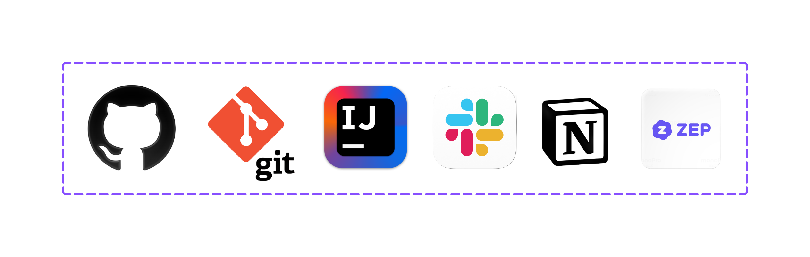

# 🫐 berryselect
> 🏆 **KB IT's Your Life 해커톤 우수상 (2025)**

## 📂 Project Goal

---

결제 직전 최적 카드·멤버십 혜택을 추천하고, 거래 기반 맞춤형 소비 리포트로 개인 금융 관리를 효율화합니다.

## 👥 Team

---

<table>
  <tr>
    <td align="center" width="200">
        
      <b>이지아 팀장 👑</b> 
      í’€ìŠ¤íƒ 
      <a href="https://github.com/iridescentzia">GitHub</a>
    </td>
    <td align="center" width="200">
        
      <b>이예인</b> 
      í’€ìŠ¤íƒ 
      <a href="https://github.com/yeainlee">GitHub</a>
    </td>
    <td align="center" width="200">
        
      <b>전혜란</b> 
      í’€ìŠ¤íƒ 
      <a href="https://github.com/ra-ran">GitHub</a>
    </td>
    <td align="center" width="200">
        
      <b>주수빈</b> 
      í’€ìŠ¤íƒ 
      <a href="https://github.com/subeen1902">GitHub</a>
    </td>
  </tr>
</table>

## ⚙️ Tech Stack & System Architecture

---

  
  

## 관련 리포지토리
- [Frontend Repo](https://github.com/BerryPing/berryselect-frontend)
- [Backend Repo](https://github.com/BerryPing/berryselect-backend)

