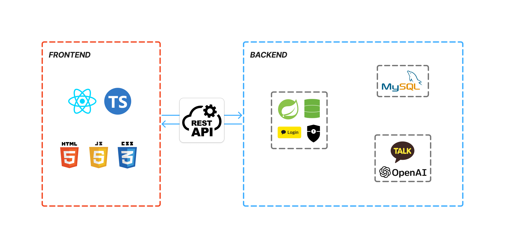

# 🫐 berryselect
> 🏆 **KB IT's Your Life 해커톤 우수상 (2025)**

## 📂 Project Goal

> 결제 직전 최적 카드·멤버십 혜택을 추천하고, 거래 기반 맞춤형 소비 리포트로 개인 금융 관리를 효율화합니다.

## 🗓️ Development Period

> 2025.08.25 ~ 2025.09.12

## 👥 Team

<table>
  <tr>
    <td align="center" width="200">
        
      <b>이지아 팀장 👑</b> 
      풀스택  
      <a href="https://github.com/iridescentzia">GitHub</a>
    </td>
    <td align="center" width="200">
        
      <b>이예인</b> 
      풀스택  
      <a href="https://github.com/yeainlee">GitHub</a>
    </td>
    <td align="center" width="200">
        
      <b>전혜란</b> 
      풀스택  
      <a href="https://github.com/ra-ran">GitHub</a>
    </td>
    <td align="center" width="200">
        
      <b>주수빈</b> 
      풀스택  
      <a href="https://github.com/subeen1902">GitHub</a>
    </td>
  </tr>
</table>

## ⚙️ Tech Stack & System Architecture

  
  

## 🌟 Key Features

### 🔑 1. Login & Sign Up
- Kakao OAuth 로그인 지원
- 사용자 인증 및 서비스 접근 제어
- JWT 기반 세션 관리

  
  

---

### 🏠 2. Home & Notification
- **사용자 맞춤형 통계 대시보드**
    - 이번 달 절감 금액
    - 추천 사용률
    - 이번 달 잔여 예산

- **최근 거래 요약**
    - 결제 내역 기반으로 최신 거래 현황 간단 확인

- **가맹점 검색**
    - 원하는 가맹점을 검색하여 베리픽 탭으로 빠른 이동

- **알림 탭**
    - 예산 초과, 기프티콘 만료, 혜택/이벤트 알림 제공
    - Kakao 알림 API 기반 주요 이벤트 알림 전송

  
  
  
  

---

### 💟 3. BerryPick
- **최적 결제 수단 추천**
    - 사용자가 가맹점과 결제 금액을 입력 후 `추천 검색하기` 버튼 클릭
    - 보유 카드 및 멤버십 자산 기반으로 최적 결제 수단 조합 계산

- **카드사 앱 리디렉션**
    - 추천된 결제 수단 선택 시, 해당 카드사 앱으로 연결되는 딥링크 지원
    - 사용자가 즉시 결제를 진행할 수 있도록 편의성 강화

  
  
  
  

---

### 💳 4. Wallet
- **자산 관리**
    - 보유 카드, 멤버십, 기프티콘을 한 곳에서 통합 관리

- **직접 등록 및 연동**
    - 통신사 및 멤버십 계정은 직접 연동하여 자동 업데이트
    - 기프티콘은 사용자가 직접 등록 가능

- **즉시 결제 지원**
    - 베리픽 추천을 거치지 않고도 월렛 탭에서 바로 결제 가능
    - 결제 시 **카드사 앱 리디렉션**을 통해 즉시 결제 진행

  
  
  
  

---

### 👩🏻‍💻 5. MyBerry
- 사용자 프로필 및 환경설정 관리
- **이번 달 소비 목표 설정**
    - 목표 예산 설정 및 변경
    - 예산 대비 진행 현황 표시
- **이번 달 소비 리포트**
    - **절감 금액**: 이번 달 최적 혜택 사용으로 절감한 금액을 표시
    - **추천 사용률**: 혜택 추천 기능을 실제 결제에서 활용한 비율 제공
    - **카테고리별 차트 시각화**: 결제 내역 기반으로 이번 달 소비를 카테고리별로 그래프화
    - **AI 소비 요약**: OpenAI API를 활용해 이번 달 소비 패턴을 자연어로 요약 제공
    - **최근 거래 내역**: 최신 결제 내역을 간단히 확인 가능

  
  
  
  

## 💻 Related Repositories
> - [Frontend Repository](https://github.com/BerryPing/berryselect-frontend)
> - [Backend Repository](https://github.com/BerryPing/berryselect-backend)

