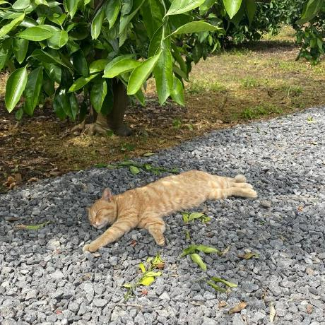

# 🫐 berryselect
> 🏆 **KB IT's Your Life 해커톤 우수상 (2025)**

## 📂 Project Goal

결제 직전 최적 카드·멤버십 혜택을 추천하고, 거래 기반 맞춤형 소비 리포트로 개인 금융 관리를 효율화합니다.

## 👥 Team

<table>
  <tr>
    <td align="center" width="200">
        
      <b>이지아 팀장 👑</b> 
      풀스택  
      <a href="https://github.com/iridescentzia">GitHub</a>
    </td>
    <td align="center" width="200">
        
      <b>이예인</b> 
      풀스택  
      <a href="https://github.com/yeainlee">GitHub</a>
    </td>
    <td align="center" width="200">
        
      <b>전혜란</b> 
      풀스택  
      <a href="https://github.com/ra-ran">GitHub</a>
    </td>
    <td align="center" width="200">
        
      <b>주수빈</b> 
      풀스택  
      <a href="https://github.com/subeen1902">GitHub</a>
    </td>
  </tr>
</table>

## ⚙️ Tech Stack & System Architecture

  
  

## 🌟 Key Features

---

### 🔑 1. Login & Sign Up
- Kakao OAuth 로그인 지원
- 사용자 인증 및 서비스 접근 제어
- JWT 기반 세션 관리

  
  

---

### 🏠 2. Home & Notification
- 사용자 맞춤형 알림/요약 정보 제공
- Kakao 알림 API 기반 주요 이벤트 알림 전송
- 실시간 상태 표시

  
  
  
  

---

### 💟 3. BerryPick
- 사용자 카드·멤버십 조합 최적 혜택 추천

  
  
  
  

---

### 💳 4. Wallet
- 보유 카드/멤버십 자산 관리
- 혜택 레벨·포인트 현황 표시

  
  
  
  

---

### 👩🏻‍💻 5. MyBerry
- 사용자 프로필 및 환경설정 관리
- 알림 수신 여부, 선호 혜택 카테고리 설정
- **이번 달 소비 목표 설정**
    - 목표 예산 설정 및 변경

- **이번 달 소비 리포트**
    - **절감 금액**: 이번 달 최적 혜택 사용으로 절감한 금액을 표시
    - **추천 사용률**: 혜택 추천 기능을 실제 결제에서 활용한 비율 제공
    - **카테고리별 차트 시각화**: 결제 내역 기반으로 이번 달 소비를 카테고리별로 그래프화
    - **AI 소비 요약**: OpenAI API를 활용해 이번 달 소비 패턴을 자연어로 요약 제공
    - **최근 거래 내역**: 최신 결제 내역을 간단히 확인 가능

  
  
  
  

## 관련 리포지토리
- [Frontend Repo](https://github.com/BerryPing/berryselect-frontend)
- [Backend Repo](https://github.com/BerryPing/berryselect-backend)

